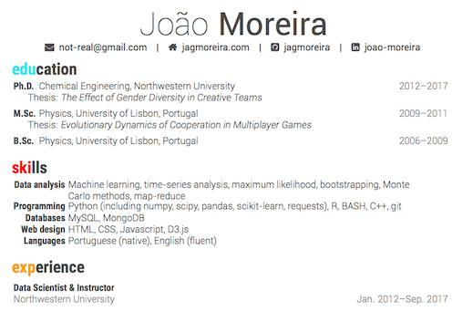
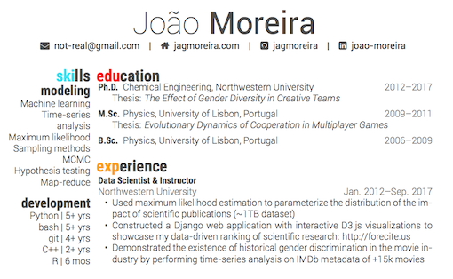

# Friggen-Awesome-CV

Friggen-Awesome CV is a XeLateX template for a CV or resumé based on [CV-Friggeri-X](https://github.com/Nadorrano/cv-friggeri-x) by [Nadorrano](https://github.com/Nadorrano), with a dash of [Awesome-CV](https://github.com/posquit0/Awesome-CV) by [posquit0](https://github.com/posquit0). Both of those templates are inspired by [Fancy CV](https://www.sharelatex.com/templates/cv-or-resume/fancy-cv) template, originally released by [Adrian Friggeri](https://github.com/afriggeri).


## Layout options

#### Default layout

The default template will fill the full width of the page with the content.




#### Layout with sidebar

You can also specify a `sidebar` template option to create an `aside` section:

    \documentclass[sidebar]{friggen-awesome-cv}

The template uses `minipage` and `geometry` so content in sidebar and main sections are always aligned.




## Other template options

* A4 paper size: `\documentclass[a4paper]{friggen-awesome-cv}`
* Black and white template: `documentclass[nocolors]{friggen-awesome-cv}`


## Compiling the template

1. Create a file with your contact info:
    ```
    $ cp sections/personal.template.tex sections/personal.tex
    ```

    You should do this to keep your personal contact, like email or phone number, out of a public repo.

1. Compile the template using `xelatex`:
    ```
    $ xelatex resume.tex
    ```

    Alternatively, if you have `latexmk` installed you can use the provided Makefile to compile:

    * To create the pdf file: `$ make` or `$ make all` or `$ make resume.pdf`
    * To clean up temporary latex files: `$ make decrap`
    * To also delete the compiled pdf file: `$ make clean`


## What's different from [CV-Friggeri-X](https://github.com/Nadorrano/cv-friggeri-x)

#### New header

*  Adapted from [Awesome CV](https://github.com/posquit0/Awesome-CV) by [posquit0](https://github.com/posquit0)
* Uses fancyhdr instead of TikZ
* All contact info is now in header
* Icons are created with FontAwesome
* Removed the previous default black header


#### Bibliography

The latest version of `biblatex` broke the bibliography section of the original template. Since I wasn't using that section on my current resumé I commented that out. Maybe in the future I'll update that portion of the code. [This might be a good starting point](https://tex.stackexchange.com/q/327316).


## Credits

The original Friggeri CV is released under the MIT license. See FRIGGERI-LICENSE.

[Nadorrano](https://github.com/Nadorrano)'s [CV-Friggeri-X](https://github.com/Nadorrano/cv-friggeri-x) and my version are released under CC BY-NC-SA license.

[LaTeX FontAwesome](https://github.com/furl/latex-fontawesome) is the binding for the FontAwesome icons used in this template.

[Roboto](https://github.com/google/roboto) is the open source font family created by Google for their visual language, Material Design.
